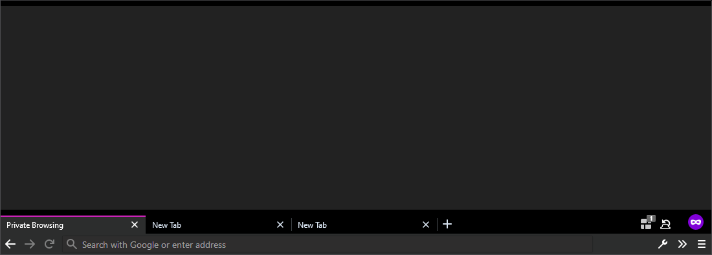
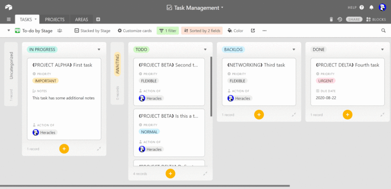

# /userstyles

A collection of home-made UserStyle CSS files, to be used with Stylus or other browser mechanism. UserStyles are used to modify the appearance (what you see) of a select few websites which the author frequently uses and would rather were design differently.

Use with the **Stylus** browser addon (for [Firefox](https://addons.mozilla.org/el/firefox/addon/styl-us/), for [Chrome](https://chrome.google.com/webstore/detail/stylus/clngdbkpkpeebahjckkjfobafhncgmne)). Be cautious of similar-named addons as they’re often used to collect data without your consent. For an intoduction on how to use and experiment with Stylus (no need to be a programmer) see [“Redesign Your Favorite Websites — Stylus Extension for FireFox or Chrome”](https://medium.com/@coffmans/redesign-your-favorite-websites-stylus-extension-for-firefox-or-chrome-c5d5ae68e288).

These UserStyles may update automatically to accomodate for improvements and breaking changes, but they are primarily intented for my personal use, hence I am reluctant to changes that do not serve my use cases. You may use the [Issue page](https://github.com/Arty2/userstyles/issues) to report any unintented behaviour (bugs) or breaks (usually when the website implements a major change) that you come accross.

## Index

Click on “Install this style” to preview the CSS code and install directy if you already have Stylus enabled. All styles support automatic updates.

- Global styles
    + [Hide dickbars](#hide-dickbars) — Hides “dickbars”] ([as defined by John Gruber](https://daringfireball.net/linked/2011/03/06/dickbar)), i.e. annoying CTAs and floating bars in several websites. Including: facebook.com; instagram.com; tumblr.com etc.
    + [Thin scrollbars](#thin-scrollbars) — Applies thin scrollbars to all windows and elements. The colors are configurable. ([Firefox only](https://developer.mozilla.org/en-US/docs/Web/CSS/scrollbar-width#Browser_compatibility))
- UserChrome.css
    + [tabs_to_bottom.userchrome.css](#tabs_to_bottomuserchromecss) — Moves the tab and URL bar to the bottom of the window.
    + [proton_theme_tweaks.userchrome.css](#proton_theme_tweaksuserchromecss) — Tweaks for the Firefox Proton theme.
- airtable.com
    + [airtable.com dark theme](#airtablecom-dark-theme) — Dark theme for airtable.com. Beta quality, beware of 🐛.
    + [airtable.com neat kanban](#airtablecom-neat-kanban) — Modifies the display of Airtable’s Kanban view to make better use of available space and simplify the cards UI.
- paper.dropbox.com
    + [paper.dropbox.com focus theme](#paperdropboxcom-focus-theme) — Stylistic changes to forus on the editor.

* * *

## Global styles

Global or single-purpose styles that apply to multiple domains.

### Hide dickbars

Hides “dickbars” ([as defined by John Gruber](https://daringfireball.net/linked/2011/03/06/dickbar)), i.e. annoying CTAs and floating bars in several websites. Currently: facebook.com; instagram.com; linkedin.com, tumblr.com; twitter.com; newyorker.com; nytimes.com (incl. wirecutter); wired.com; artforum.com; japantimes.co.jp; kathimerini.gr; verge.com; artforum.com; creativeapplications.net.
These UserStyles are neither able nor intent to bypass [paywalls](https://en.wikipedia.org/wiki/Paywall), but instead provide a convenient way to view content without obstructions. Please be aware that they are not thoroughly tested, and on occasion may break useful functionality of the targeted websites, such as login pop-ups. For more complete applications, there are elaborate solutions such as [@yourduskquibbles/webannoyances](https://github.com/yourduskquibbles/webannoyances) or [12ft.io](https://12ft.io/).

📦 [Install this style](https://raw.githubusercontent.com/Arty2/userstyles/master/_hide-dickbars.user.css)

### Thin scrollbars

Applies thin scrollbars to all windows and elements. The colors are configurable. ([Firefox only](https://developer.mozilla.org/en-US/docs/Web/CSS/scrollbar-width#Browser_compatibility))

📦 [Install this style](https://raw.githubusercontent.com/Arty2/userstyles/master/_thin-scrollbars.user.css)

## UserChrome.css

Styles to modify the User Interface of Mozilla Firefox through [UserChrome.css](https://kb.mozillazine.org/index.php?title=UserChrome.css). Their installation is [not as straightforward](https://www.howtogeek.com/334716/how-to-customize-firefoxs-user-interface-with-userchrome.css/), and this feature is disabled by default.

1. On Windows, navigate to `%APPDATA%\Mozilla\Firefox\Profiles` (you can copy/paste this in the Explorer address bar) or open the *Local Directory* of the profile in use by visiting `about:profiles` from the browser address bar. The profile in use is the one you cannot delete. On Linux, use the *Root Directory* instead, under `~/.mozilla/firefox/`.
2. Create a folder named `chrome` then create inside it a file named `userChrome.css`  where you will paste the relevant code.
3. Open `about:config` and set `toolkit.legacyUserProfileCustomizations.stylesheets` to *true*. The default is *false*.
4. Restart the browser for the styles to take effect.

### tabs_to_bottom.userchrome.css

Moves the tab and URL bar to the bottom of the window. It’s where browser tabs should be by default in Windows, if proximity to the taskbar matters.

💾 [Inspect the code](https://raw.githubusercontent.com/Arty2/userstyles/master/tabs_to_bottom.userchrome.css)

### proton_theme_tweaks.userchrome.css

Tweaks for the default *Firefox Proton* theme to remove border radius from several elements and make tabs bar more compact.

💾 [Inspect the code](https://raw.githubusercontent.com/Arty2/userstyles/master/proton_theme_tweaks.userchrome.css)

## airtable.com

### airtable.com dark theme

Dark theme for airtable.com. Alpha quality, beware of 🐛.

📦 [Install this style](https://raw.githubusercontent.com/Arty2/userstyles/master/airtable-com_dark-theme.user.css)

### airtable.com neat kanban

Modifies the display of Airtable’s Kanban view to make better use of available space and simplify the cards UI. It also modifies a collaborator field with the *configurable* title “Action of”, if it exists.

📦 [Install this style](https://raw.githubusercontent.com/Arty2/userstyles/master/airtable-com_neat-kanban.user.css)

## paper.dropbox.com

### paper.dropbox.com focus theme

A set of styles that turns the sidebar and menus partialy transparent when the cursor is not over them. Includes some stylistic changes over the display of text, eg. — instead of bullet points, Input font (if exists on the system).

📦 [Install this style](https://raw.githubusercontent.com/Arty2/userstyles/master/paper-dropbox-com_focus.user.css)

* * *

© 2020-2024 [Heracles Papatheodorou](https://heracl.es) a.k.a [@heracles](https://mastodon.social/@heracles), MIT Licence
